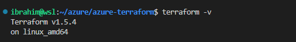
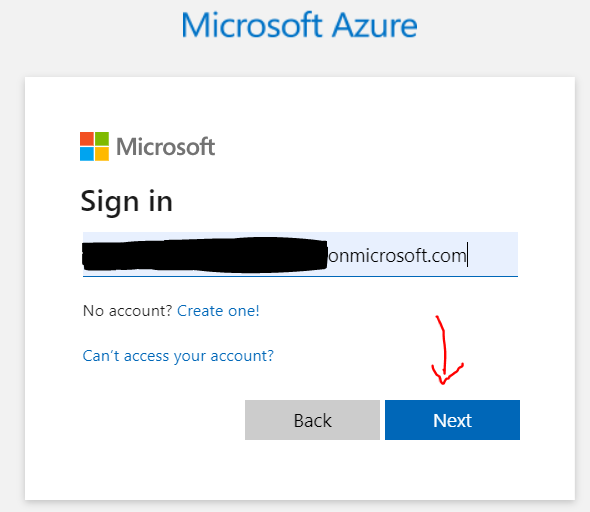
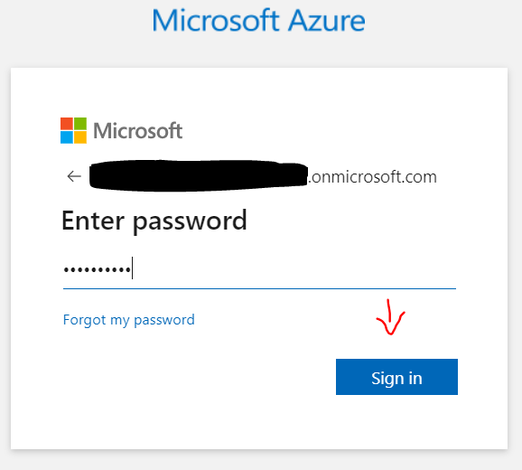
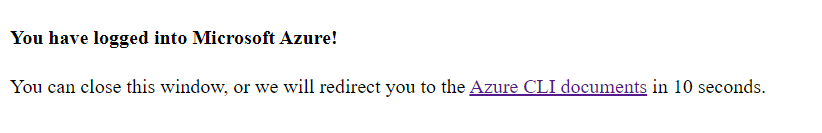
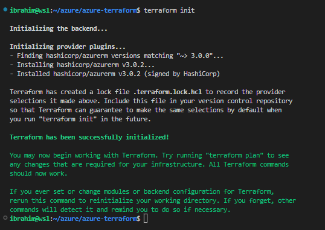
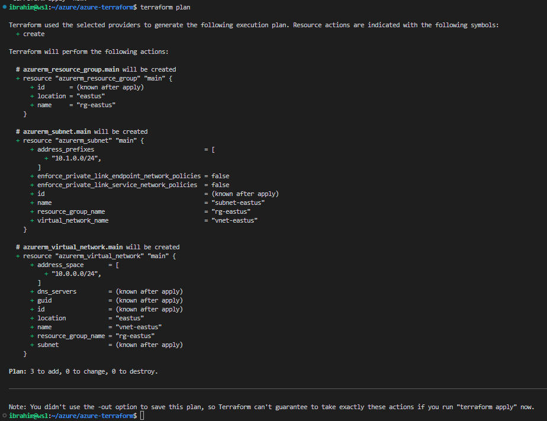
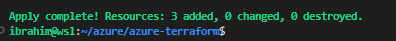
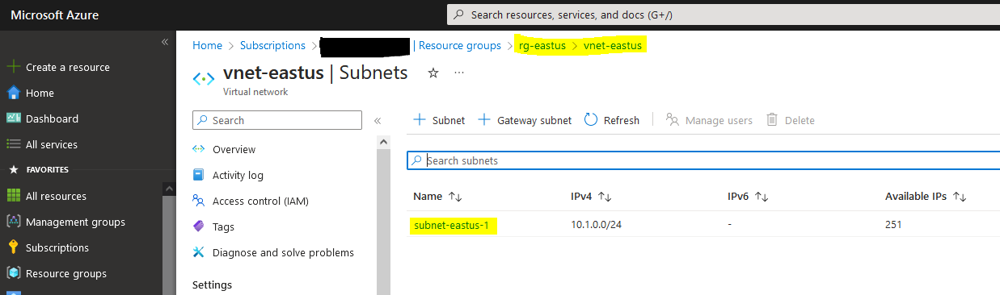
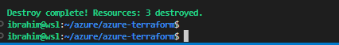

## azure-terraform
The objective of this repo is to set up the environment in order to deploy Azure resources using Terraform.

## Configure the environment
### Pre-requisites
* Have an [Azure subscription](https://www.educative.io/answers/how-to-create-a-microsoft-azure-subscription)
* Install [Terraform](https://developer.hashicorp.com/terraform/tutorials/azure-get-started/install-cli) and [Azure CLI](https://learn.microsoft.com/en-us/cli/azure/install-azure-cli)
Note: We will be using [Windows WSL](https://code.visualstudio.com/docs/remote/wsl-tutorial) CLI in VS Code

### Authenticate to Azure using Microsoft Account
* Verify you have installed Terraform

* Verify you have install Azure CLI

* Run command `az login`

* Follow the link and login through the web browser:first enter thr domain, then the password followed by MFA if you have multi-factor authentication enabled.

* You should see this on your browser

* Run command `az account show` to verify you are logged in

* If you want to use a specific subscription, run the command below:  
`az account set --subscription "subscription_id_or_name"`

### Create resources in Azure via Terraform
#### Set up Terraform files
See `main.tf` file in this repo as an example.
#### Run commands locally
* Initiate Terraform by running `terraform init`

* Run `terraform plan`

* Run `terraform apply`. Type `yes` when prompted to enter value

* You can see the resources (resource group, virtual network and subnet) have been created

* To clean, run `terraform destroy`. Type `yes` when prompted to enter value.

--

#### Use GitHub Action - A pipeline
##### Authenticate to Azure using a service principal (SPN)
* This method can be used when automating deployment of Azure resources.
* See also how to use [GitHub Actions](https://learn.microsoft.com/en-us/azure/developer/github/connect-from-azure?tabs=azure-portal%2Cwindows) to connect to Azure and deploy resources.
* Follow this [link](https://learn.microsoft.com/en-us/azure/developer/terraform/authenticate-to-azure?tabs=bash) for more information about Azure authentication via Terraform using [SPN](https://learn.microsoft.com/en-us/cli/azure/authenticate-azure-cli).

### Source
1. [terraform-azure](https://github.com/LinkedInLearning/terraform-azure-2453108)