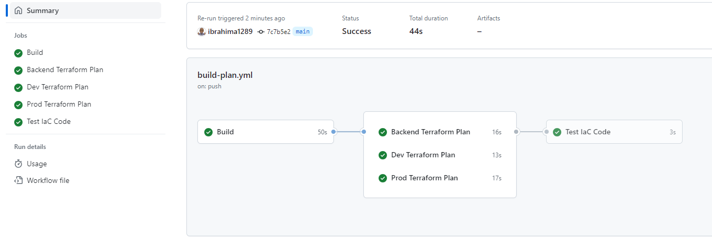

### Use GitHub Action - A pipeline
#### Authenticate to Azure using a service principal (SPN)
* This method can be used when automating deployment of Azure resources.
    * See this [link](https://github.com/ibrahima1289/azure-terraform/blob/main/user-login.md) to login to the CLI as a user
* See also how to use [GitHub Actions](https://learn.microsoft.com/en-us/azure/developer/github/connect-from-azure?tabs=azure-portal%2Cwindows) to connect to Azure and deploy resources.
* Follow this [link](https://learn.microsoft.com/en-us/azure/developer/terraform/authenticate-to-azure?tabs=bash) for more information about Azure authentication via Terraform using [SPN](https://learn.microsoft.com/en-us/cli/azure/authenticate-azure-cli).

#### Configure the files 
See foleder structure in this repo

#### Test run
Push a change to main branch. This will trigger the **Build - Plan - Test** pipeline 

#### Sources:
1. [Azure CLI Login](https://silentexception.com/article/Azure-login-in-Github-Actions-via-Service-Principal)
2. [Microsoft Azure](https://github.com/Azure/login/tree/v1/)
3. [Backend TF state](https://nathan.kewley.me/2020-06-17-deploy-to-azure-using-terraform-and-github-actions/)

