### Authenticate to Azure using Microsoft Account

* Verify you have installed Terraform

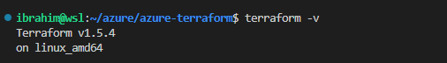

* Verify you have install Azure CLI

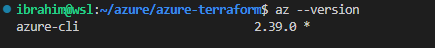

* Run command `az login`

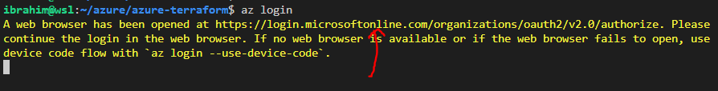

* Follow the link and login through the web browser:first enter thr domain, then the password followed by MFA if you have multi-factor authentication enabled.

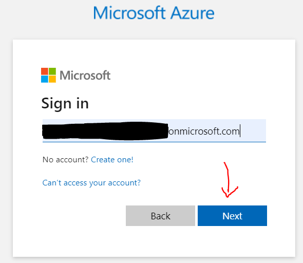
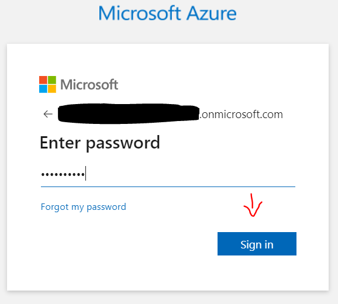

* You should see this on your browser

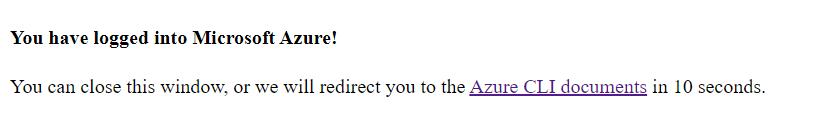

* Run command `az account show` to verify you are logged in

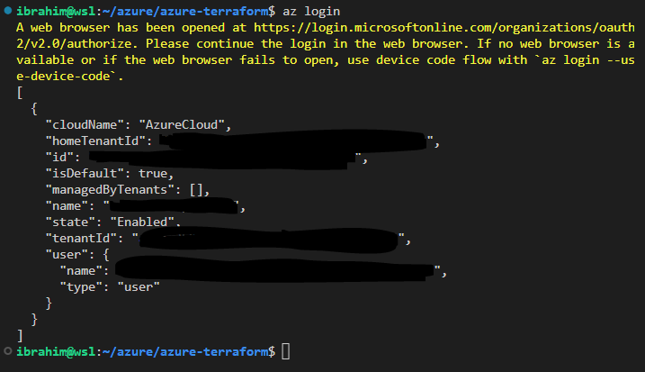

* If you want to use a specific subscription, run the command below:  
`az account set --subscription "subscription_id_or_name"`

### Create resources in Azure via Terraform
#### Set up Terraform files
See `main.tf` file in this repo as an example.
#### Run commands locally
* Initiate Terraform by running `terraform init`

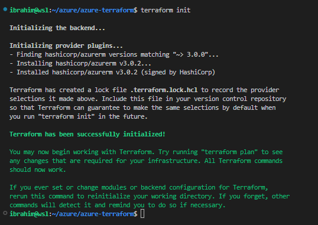

* Run `terraform plan`

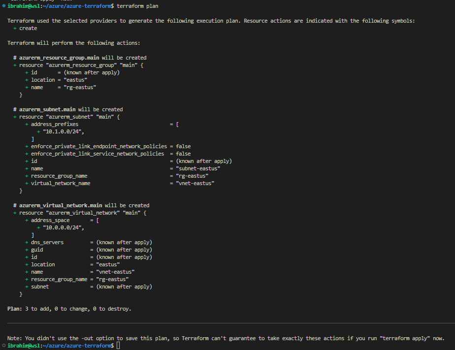

* Run `terraform apply`. Type `yes` when prompted to enter value

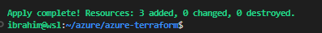

* You can see the resources (resource group, virtual network and subnet) have been created

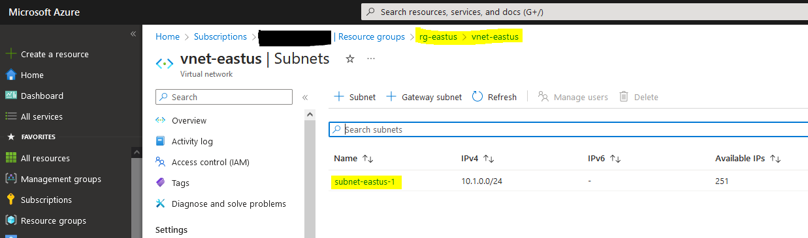

* To clean, run `terraform destroy`. Type `yes` when prompted to enter value.

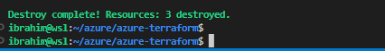

